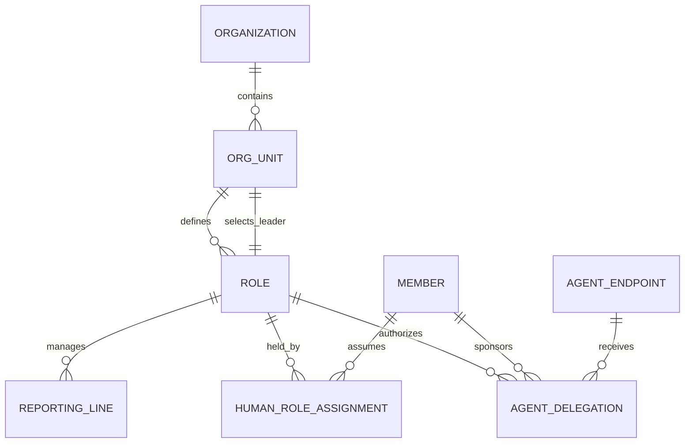
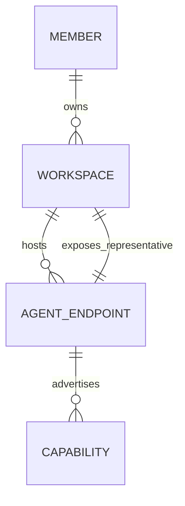

# 百工：组织化人机协作与递归任务委派设计

> 日期：2026-07-27
>
> 状态：已通过对话确认，待书面复核
>
> 范围：单组织内的组织树、人机责任、递归委派、Inbox 与 Artifact 闭环
>
> 上位资料：`百工BAIGONG_多人多Agent联邦协作系统调研报告_v0.2.docx`、`百工BAIGONG_架构模块分解与开源实现参考_v0.3.md`

## 1. 设计结论

百工把真实组织映射为数字组织，但不把人替换成 Agent。

核心模型为：

> 任务属于组织，责任属于 Role，Role 由人担任，Agent 接受人的授权执行工作；当目标、风险、权限或价值判断超出授权边界时，任务回到人。

系统采用以下设计：

1. Organization 由递归 OrgUnit、稳定 Role 和 ReportingLine 构成。
2. 每个 OrgUnit 指定一个 Leader Role，Leader Role 不绑定某个固定的人或 Agent。
3. HumanRoleAssignment 表示谁承担组织责任，AgentDelegation 表示哪个 Agent 可以在什么范围内代理执行。
4. 每个 Member 拥有一个或多个主权 Workspace；Workspace 内部可以运行多个 Agent，并通过 Workspace Representative 对组织提供统一入口。
5. 根任务首先进入 Leader Role Inbox；Leader Agent 在授权范围内规划、拆解并向下属 Role 递归委派。
6. 责任关系使用单一责任树，执行依赖使用 DAG，二者分离。
7. Inbox 保障人、Role 和 Agent 之间的可靠信息交互；Task Fabric 是任务状态唯一真相。
8. Artifact 是不可变、可验证、可追踪的正式交付对象，必须经过逐级 Submission 和 Review。
9. 人类是 Role Holder、Human Sponsor、Requester、Collaborator、Reviewer、Approver 和 Operator，可以随时暂停、纠正、接管或撤销 Agent。

## 2. 目标和非目标

### 2.1 目标

- 用真实组织容易理解的方式表达 Leader、下属、逐级汇报和问责。
- 让多个 Member 保留自己的 Workspace、Agent、数据和工具边界。
- 支持任意深度的任务拆解和委派，同时保持每一级责任清晰。
- 支持 Agent 间、员工间以及 Agent 与员工间的可靠通信。
- 让 Leader 或 Agent 更换后，组织 Inbox、任务和 Artifact 继续存在。
- 对需要人类参与的决策提供确定性暂停、路由、决策和恢复。
- 让最终交付可以追踪到 Task、Role、Member、Agent、Workspace 和 Capability。

### 2.2 非目标

MVP 不包含：

- 跨企业控制面联邦；
- 矩阵式汇报和多人共同 Accountable；
- 公网 Agent 市场、支付与自动结算；
- 完全无人负责的自治组织角色；
- 自动信誉分配和复杂贡献结算；
- 完整员工即时通讯和社交产品；
- 自动 Skill 提炼、跨组织传播和组织知识图谱；
- 通过分布式事务统一多个组织状态。

## 3. 关键设计原则

### 3.1 组织责任与 Agent 执行分离

Role 是组织责任位置。Member 通过 HumanRoleAssignment 担任 Role；Agent 通过 AgentDelegation 获得代理权限。Agent 不因被绑定而成为责任主体。

### 3.2 角色稳定，执行者可替换

Role Inbox、Task、Artifact 和组织记忆属于 Role 或 OrgUnit，不属于当前任职者或 Agent。人员变动只更新 HumanRoleAssignment；Agent 变动只更新 AgentDelegation。

### 3.3 人是第一等主体

每个组织性 Agent 行为至少记录：

```text
organization_role
human_sponsor
agent_principal
workspace
agent_delegation
task_ref
```

系统不得使用 Agent 身份冒充 Member，也不得使用 Member 的长期个人令牌作为 Agent 身份。

### 3.4 委派执行权，不转移最终问责

Leader 可以把子任务交给下属，但仍对父 Task 的结果负责。每个 Task 只有一个 Accountable Role。

### 3.5 组织结构与任务结构分离

ReportingLine 描述组织管理关系；Responsibility Tree 描述本次任务的直接问责关系；Execution DAG 描述任务依赖。三者不能使用同一个 `parent_id` 代替。

### 3.6 权限随委派衰减

向下委派时，权限、数据范围、预算、期限和可继续委派深度只能保持或收紧，不能扩大。

### 3.7 聊天不是事务真相

自然语言消息用于协作，但 Task、Delegation、Approval、Submission 和 Review 必须是持久化结构对象。聊天不能直接推进状态机。

### 3.8 Artifact 不可变

Artifact 内容使用不可变版本；修改必须产生新版本。最终交付引用已验收版本，而不是某个可变目录。

## 4. 领域模型

### 4.1 组织与责任



#### Organization

完整治理和信任域。

#### OrgUnit

可递归嵌套的公司、事业部、部门或小组。每个 OrgUnit 必须指定一个有效 Leader Role。

#### Role

稳定职责位置。Role 不等于职称字符串，必须具备明确责任范围。

#### ReportingLine

MVP 中只支持形成无环单一责任树的管理关系。

#### HumanRoleAssignment

记录 Member 在某段时间担任 Role。MVP 允许一个 Primary Assignment 和一个 Backup Assignment。

#### AgentDelegation

记录 Human Sponsor 将指定范围的 Role 执行权授予 Agent Endpoint。至少包含：

```text
role_id
sponsor_member_id
agent_endpoint_id
allowed_actions
resource_scope
budget_limit
autonomy_policy
valid_from
valid_until
status
version
```

### 4.2 Workspace 与 Agent



Workspace 是主权执行域。组织默认只能调用 Workspace Representative 和公开 Capability。Workspace 内部 Agent 拆解、私有记忆和文件布局不是组织控制面的职责。

Workspace 可以主动将内部专业 Agent 发布为独立 Agent Endpoint，但不能由组织控制面自动探测或绕过 Representative 调用。

### 4.3 Task、计划与委派

```text
Task
├── TaskPlan[]
├── Child Task[]
├── Delegation[]
├── TaskAttempt[]
├── TaskThread
├── Submission[]
└── Review[]
```

每个 Task 至少包含：

```text
owning_org_unit
accountable_role
assigned_role
human_sponsor
parent_task
root_task
goal
definition_of_done
budget
deadline
security_level
state
epoch
version
```

TaskPlan 是可版本化的拆解方案。启用新计划时递增 Task epoch；旧 epoch 不得开始新的外部副作用。

Delegation 是上级 Role 和下级 Role 之间的合同，至少包含：

```text
delegator_role
delegatee_role
task_ref
objective
input_artifact_refs
expected_output_schema
definition_of_done
budget
deadline
permission_grants
evidence_requirements
allowed_tools
allowed_subdelegation
max_delegation_depth
reporting_policy
escalation_policy
cancellation_policy
```

Delegation 必须经过 `PROPOSE → ACCEPT | REJECT | COUNTEROFFER`，接受后才能创建 TaskAttempt。

TaskAttempt 表示一次具体执行。重试、更换 Workspace 或更换 Agent 必须创建新 Attempt，不能覆盖失败历史。

### 4.4 责任分配

每个 Task 使用简化 RACI：

- Accountable：唯一，对最终结果负责；
- Responsible：当前负责执行的 Role；
- Contributor：提供协作或部分 Artifact；
- Reviewer/Approver：负责评审或审批；
- Informed：接收通知。

一个 Member 可以担任多个 Role，但一次 Task 中的 Accountable 仍只能有一个。

## 5. Inbox 与信息交互

### 5.1 统一 Inbox Service

底层只有一个 Inbox Service，通过 `owner_type` 形成：

- Role Inbox：接收组织任务、下属交付、审批和异常；
- Member Inbox：员工沟通、人工决策和提醒；
- Agent Inbox：执行指令、Agent 请求和控制信号；
- Task Thread：与 Task 关联的重要协作记录。

Role Inbox 属于 Role。Leader 更换时不得迁移或重建 Inbox。

### 5.2 结构化消息

首批消息类型：

```text
TASK_PROPOSAL
TASK_ACCEPTED
TASK_REJECTED
TASK_COUNTEROFFER
STATUS_UPDATE
COLLAB_REQUEST
ARTIFACT_SUBMITTED
REVIEW_REQUESTED
APPROVAL_REQUESTED
ESCALATION
CANCEL
CONVERSATION
```

消息信封至少包含：

```text
message_id
sender_principal
sender_role
recipient
task_ref
thread_ref
delegation_chain
message_type
payload_ref
reply_to
correlation_id
causation_id
priority
ttl
visibility
security_label
ack_policy
idempotency_key
```

### 5.3 通信规则

- 向下委派必须使用 Delegation Contract；
- 向上汇报必须关联 Task 和 Attempt；
- 同级 Agent 可以发送协作请求，但不能突破原任务权限和预算；
- 越级请求默认进入对方 Role Inbox，并携带完整委派链；
- 影响范围、预算、风险或验收的员工沟通必须进入 Task Thread；
- Message 只触发命令处理，不能直接覆盖 Task 状态。

### 5.4 可靠性

Inbox 使用至少一次投递。发送方使用 Transactional Outbox，接收方按 `message_id` 和 `idempotency_key` 去重，并返回 `ACK | REJECT | DEFER`。

Task Fabric 是 Task 状态权威；Inbox 只负责可靠送达。

## 6. 递归任务运行

每一级 Leader 使用同一循环：

1. 从 Role Inbox 领取 Task lease；
2. 读取授权后的组织上下文和输入 Artifact；
3. 生成 TaskPlan；
4. 通过确定性规则验证预算、权限、DAG 和 DoD；
5. 创建 Child Task；
6. 向下属 Role 发出 Delegation Proposal；
7. 处理接受、拒绝或反提案；
8. 下属继续拆解或创建 TaskAttempt；
9. 收集 Submission；
10. Review 下属交付；
11. 汇聚为自己的 Submission；
12. 向直接上级提交。

责任树用于问责，Execution DAG 用于调度。子 Task 可以具有同级依赖，但只能有一个直接 Accountable Role。

## 7. 人类参与和自治策略

### 7.1 自治等级

每个 AgentDelegation 对动作配置：

```text
AUTO
AUTO_WITH_NOTIFY
REQUIRE_APPROVAL
HUMAN_ONLY
DENY
```

默认规则：

- 预算内的普通子任务拆解可以 AUTO；
- 向已有下属委派低风险任务可以 AUTO_WITH_NOTIFY；
- 修改根目标、DoD、预算、期限或敏感数据范围必须 REQUIRE_APPROVAL；
- 生产发布、不可逆删除、外部正式承诺默认 REQUIRE_APPROVAL；
- 人事、法务、财务承诺默认 HUMAN_ONLY；
- 根 Task 最终验收默认由 Human Role Holder 完成；
- 暂停任务和撤销 AgentDelegation 始终允许有权限的人直接执行。

### 7.2 Human Intervention Request

请求类型：

```text
CLARIFICATION
PLAN_REVIEW
APPROVAL
ARTIFACT_REVIEW
ARBITRATION
OVERRIDE
TAKEOVER
ESCALATION
```

请求至少包含：

```text
request_type
task_ref
requesting_agent
sponsor_member
responsible_role
decision_context
proposed_action
alternatives
risk_summary
affected_artifacts
deadline
default_on_timeout
```

人类可以：

```text
APPROVE
REJECT
EDIT_AND_APPROVE
REQUEST_MORE_INFORMATION
DELEGATE_TO_ANOTHER_HUMAN
TAKE_OVER
```

当策略要求人类介入时，Task 或 Attempt 进入 `WAITING_HUMAN`，运行时保存 checkpoint。高风险请求超时默认拒绝；其他请求按政策升级到 Backup Role 或上级 Leader。

## 8. Artifact、Submission 与 Review

### 8.1 Artifact

Artifact Version 是内容寻址的不可变对象，至少记录：

```text
content_hash
media_type
producer_agent
accountable_role
source_task
source_attempt
input_artifacts
capability_versions
sensitivity
license
retention_policy
verification_status
access_grants
```

### 8.2 Submission

下属向直接上级提交：

```text
task_ref
artifact_refs
completion_summary
evidence_refs
known_limitations
unresolved_risks
requested_decision
```

Review 决定为：

```text
ACCEPT
REJECT
REQUEST_CHANGES
PARTIALLY_ACCEPT
ESCALATE
```

Artifact 提交不自动完成 Task。只有直接上级 Review 通过，Child Task 才能进入成功状态。

### 8.3 汇聚

上级生成新的派生 Artifact，并通过 Lineage 引用下属结果，不复制或覆盖原 Artifact。根 Task 最终生成 Deliverable Manifest。

## 9. 状态机

### 9.1 Task

```text
DRAFT
→ PLANNING
→ DELEGATING
→ ACTIVE
→ REVIEW
→ SUCCEEDED
```

旁路状态：

```text
WAITING_HUMAN
BLOCKED
REPLANNING
CANCELLING
COMPENSATING
FAILED
CANCELLED
```

### 9.2 Delegation

```text
PROPOSED
→ ACCEPTED
→ ACTIVE
→ DELIVERED
→ CLOSED
```

旁路状态：

```text
COUNTEROFFERED
REJECTED
EXPIRED
REVOKED
FAILED
```

### 9.3 TaskAttempt

```text
CREATED
→ LEASED
→ RUNNING
→ SUBMITTED
→ COMPLETED
```

旁路状态：

```text
WAITING_HUMAN
INTERRUPTED
EXPIRED
FAILED
QUARANTINED
```

状态修改使用 `expected_version` 做 CAS；Task 重规划和转派额外携带 `epoch`。

## 10. 权威边界与持久化

| 事实 | 权威模块 |
|---|---|
| 当前组织结构和 Leader | Organization Service |
| 当前 Human Role Holder | Organization Service |
| Agent 可以代表谁做什么 | Policy Service / AgentDelegation |
| Task 当前状态 | Task Fabric |
| 消息是否送达 | Inbox Service |
| Artifact 内容和版本 | Artifact Service |
| 人类审批结果 | Approval Service |
| Agent 执行进度 | TaskAttempt |
| 历史事件和证据 | Audit Ledger |

推荐 MVP 持久化：

- PostgreSQL：领域聚合、消息元数据、版本和 Transactional Outbox；
- NATS JetStream：Inbox 通知、任务事件和消费；
- S3/MinIO：Artifact 内容；
- OpenTelemetry：Trace、Metric 和 Log；
- 独立 append-only Audit Ledger：不可采样的审计事件。

消息队列、Agent Memory 和 OpenTelemetry 都不得替代领域状态。

## 11. 权限与预算不变量

系统必须验证：

```text
child.permissions ⊆ parent.permissions
child.budget ≤ parent.remaining_budget
child.deadline ≤ parent.deadline
child.data_scope ⊆ parent.data_scope
child.delegation_depth < parent.delegation_depth
```

附加不变量：

1. 同级 Role 默认不能读取彼此 Workspace。
2. Agent 行为必须具有有效 AgentDelegation 和 Human Sponsor。
3. AgentDelegation 到期或撤销后不得开始新副作用。
4. 子任务权限只能继承并收紧，不能由 Agent 自行扩张。
5. Artifact 派生物继承或收紧敏感度、许可证和保留策略。
6. 根 Task 只有一个 Accountable Role。
7. Review 通过之前，Artifact 不能进入父任务正式交付。

## 12. 故障恢复

### 12.1 Leader Agent 离线

- lease 到期后停止其新副作用；
- Task 和 Role Inbox 保持不变；
- Backup AgentDelegation 获得通知；
- 新 Agent 读取 Task Snapshot、Task Thread 和 Artifact 后取得新 lease。

### 12.2 人员更换

更新 HumanRoleAssignment 和相关 AgentDelegation。Role Inbox、Task、Artifact 和组织历史不迁移。

### 12.3 Agent 更换或重试

原 TaskAttempt 进入 `FAILED | EXPIRED | INTERRUPTED`，创建新 Attempt。不得覆盖原记录。

### 12.4 取消

取消沿 Responsibility Tree 向下传播，禁止开始新副作用。已执行动作按声明的补偿行为处理；不可补偿动作进入人工处置。

### 12.5 失败分类

```text
PLANNING_ERROR
ROUTING_ERROR
DELEGATION_REJECTED
EXECUTION_ERROR
DEPENDENCY_BLOCKED
POLICY_DENIED
CONTRACT_VIOLATION
ARTIFACT_INVALID
BUDGET_EXCEEDED
HUMAN_TIMEOUT
AGENT_UNAVAILABLE
CANCELLED_BY_PARENT
```

失败分类决定重试、重规划、重新路由、审批、隔离或升级。

## 13. 上下文压缩

Leader 默认不接收下属完整聊天和执行日志。向上级汇报只包含：

```text
状态摘要
关键决策
Artifact 引用
验收证据
已知风险
需要上级处理的问题
```

原始日志保留在 TaskAttempt 或 Workspace，按权限审计读取。这是多层组织能够扩展的必要条件。

## 14. MVP 模块

MVP 必须实现：

- Organization、递归 OrgUnit、Role 和单一 ReportingLine 树；
- HumanRoleAssignment、Human Sponsor、Primary/Backup AgentDelegation；
- Workspace、Workspace Representative 和首批 Agent Adapter；
- Role Inbox、Member Inbox、Agent Inbox、Task Thread；
- Root Task、TaskPlan、Child Task、Delegation、TaskAttempt；
- 递归委派、反提案、局部重规划和人工接管；
- Artifact Version、Submission、Review、Deliverable Manifest 和基础 Lineage；
- Autonomy Policy、Human Intervention Request 和高风险审批；
- lease、幂等、CAS、Transactional Outbox 和审计事件。

## 15. MVP 验收场景

使用三层软件团队：

```text
研发负责人
├── 前端负责人
│   └── 前端工程师
├── 后端负责人
│   ├── API 工程师
│   └── 数据库工程师
└── 测试负责人
    └── 测试工程师
```

根任务：

> 为现有系统实现用户登录、权限校验和自动化测试，并提交可运行版本和技术文档。

### 15.1 功能验收

- Leader 创建包含前端、后端和测试的 TaskPlan；
- 下属接受、拒绝或提出反提案；
- 下属 Leader 继续递归拆解；
- 同级 Agent 通过 Task Thread 协作；
- 需要修改根目标、扩大权限或生产发布时暂停并请求人类；
- Artifact 逐级提交、评审和汇聚；
- 根 Task 由 Human Role Holder 最终验收；
- 系统生成完整 Deliverable Manifest 和 Lineage。

### 15.2 可靠性验收

- 重复消息不重复创建 Task 或副作用；
- Agent 重启后可恢复 Attempt；
- Leader Agent 离线后 Backup 接管；
- 更换 Human Role Holder 后 Role Inbox 和 Task 不丢失；
- TaskPlan 新 epoch 生效后旧计划不产生新副作用；
- 取消根 Task 能传播到全部子 Task；
- Artifact 上传失败可以安全重试。

### 15.3 安全验收

- 下属不能获得父任务没有的权限；
- 同级不能读取未授权 Workspace；
- Agent 不能绕过 HumanRoleAssignment 和 AgentDelegation 执行组织行为；
- 高风险动作必须等待有权限的人决定；
- 所有动作可追溯到 Role、Member、Agent、Workspace 和 Task；
- Artifact 访问、版本和派生关系可审计。

### 15.4 业务指标

- 根任务端到端成功率；
- 人工协调消息数量和实际干预时间；
- 委派接受率与反提案率；
- Artifact 一次验收通过率；
- 平均重规划次数；
- Agent/Leader 接管恢复时间；
- 每层上下文压缩比例；
- 权限违规、数据泄露和错误审批次数。

## 16. 实现顺序

1. Organization、Role、HumanRoleAssignment 和 AgentDelegation；
2. Role Inbox、Member Inbox、Agent Inbox 和 Task Thread；
3. Task Fabric、责任树、Execution DAG 和 TaskPlan；
4. Delegation Contract、TaskAttempt、lease、幂等与状态机；
5. Artifact、Submission、Review 和 Deliverable Manifest；
6. Autonomy Policy、Human Intervention Request 和人工接管；
7. 故障恢复、审计、验收测试和业务指标。

这个顺序先建立责任和授权，再允许 Agent 执行，避免先实现自动化后补人类治理。
